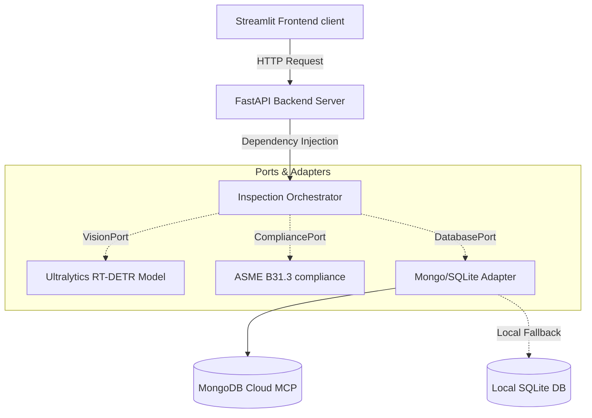

# Weld AI - Autonomous NDT Inspector
**Google for Startups AI Agents Challenge: Generative AI Hack Submission**

This repository contains an enterprise-grade autonomous quality inspection system for Non-Destructive Testing (NDT) radiography films. The architecture follows a strict **Hexagonal Architecture (Ports and Adapters)** design pattern to isolate core business rules from external frameworks, databases, and machine learning libraries.

## Decoupled Architecture

The application is split into a separate frontend client and backend API:



### Components
1. **Frontend (`frontend/app.py`)**: A Streamlit interface that handles uploading radiography files, parameter inputs, and queries history logs. It has **zero dependencies** on the backend source code (`src/`), communicating entirely via REST API.
2. **Backend API (`src/api/server.py`)**: A FastAPI microservice that processes raw radiographs, runs CLAHE image enhancement, calls the AI agent orchestrator, draws bounding boxes, and serves stored logs.
3. **Core Orchestrator (`src/core/`)**: The Antigravity reasoning agent. Decoupled from infrastructure using Python's `abc` module.
4. **Database Fallback (`src/infrastructure/adapters/mongo_adapter.py`)**: Stores final inspection verdicts. If MongoDB connection fails, is placeholder, or is unconfigured, it automatically falls back to a local SQLite database (`data/local_ndt.db`).

---

## Getting Started

### Method 1: Docker Compose (Recommended)
You can start both services and their networks with a single command:
```bash
docker-compose up --build
```
* Backend API: `http://localhost:8000`
* Streamlit Frontend: `http://localhost:8501`

### Method 2: Manual Start (Local Development)

1. **Install Dependencies**:
   ```bash
   pip install -r requirements.txt
   ```

2. **Configure Environment**:
   Create a `.env` file in the root folder:
   ```env
   GEMINI_API_KEY=your_key_here
   API_URL=http://localhost:8000
   MONGODB_URI=mcp://mongodb.partner.local
   ```
   *Note: Keeping MONGODB_URI as the placeholder will force the database adapter to run in local SQLite fallback mode.*

3. **Start FastAPI Backend**:
   ```bash
   PYTHONPATH=. uvicorn src.api.server:app --reload --port 8000
   ```

4. **Start Streamlit Frontend**:
   ```bash
   streamlit run frontend/app.py --server.port 8501
   ```

---

## Testing

Verify the codebase passes all Hexagonal Port validations and database fallback unit tests:
```bash
PYTHONPATH=. pytest
```

---

## License

This project is open-source software licensed under the [MIT License](LICENSE).

---

## Third-Party Models & Licenses

This repository integrates pre-trained machine learning weights and architectures governed by their respective creators' open-source licenses:

1. **Ultralytics YOLOv8 / YOLOv11 (e.g., `m60.pt`, `welding_defects_yolo11x.pt`)**:
   * **License**: [AGPL-3.0 License](https://github.com/ultralytics/ultralytics/blob/main/LICENSE) (Affero General Public License).
   * **Note**: For commercial deployments, a commercial license must be acquired from Ultralytics.

2. **Baidu RT-DETR (e.g., `rtdetr-l.pt`, Hugging Face checkpoints)**:
   * **License**: [Apache 2.0 License](https://github.com/lyuwenyu/RT-DETR/blob/main/LICENSE).
   * **Note**: Permissive open-source license.

